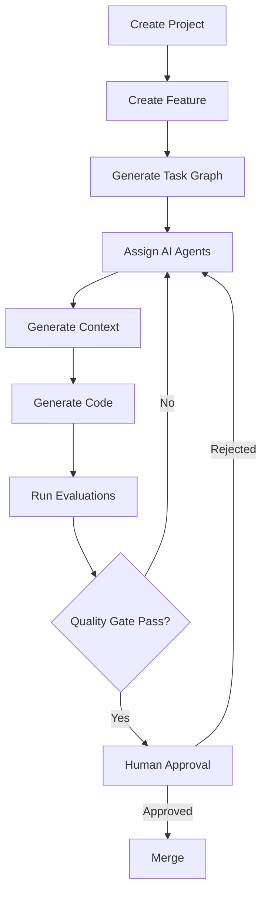

# AEP — Vision & Architecture Principles

> Companion documents (produced from the other staged prompts in this repo):
> repo structure, DB schema, API design, Agent SDK, Context Builder, Evaluation Framework,
> Dashboard UX, and Engineering Standards. This document is the North Star they all derive from —
> it does not repeat their content.

## 1. What AEP Is

The Agentic Engineering Platform (AEP) is the standardized substrate through which engineering
teams run AI coding agents across the SDLC — from feature intake to merged, evaluated, audited code.

It is a **platform**, not a demo and not a single application: teams build on top of it (via
plugins, providers, prompt templates, evaluators) rather than forking it. The closest analogy in
spirit is Spring Boot — opinionated defaults that make the "right" way the easy way, while every
major seam is an interface someone can swap out.

## 2. Design Philosophy

Four commitments shape every downstream design decision:

1. **Opinionated core, open edges.** The orchestration loop (Project → Feature → Task Graph →
   Agent → Context → Code → Eval → Approval → Merge) is fixed and not configurable per-team —
   that consistency is the product. What plugs into each stage (which LLM provider, which
   evaluator, which agent implementation) is not fixed.
2. **No provider lock-in, ever.** Claude, OpenAI, Gemini, Vertex AI, and providers that don't
   exist yet must be interchangeable behind one interface. This is a hard constraint, not an
   aspiration — see ADR-002.
3. **Everything is auditable by construction.** Because agents write code that humans are
   ultimately accountable for, every agent action, prompt, context package, and evaluation result
   must be reconstructable after the fact. Auditability is not a logging feature bolted on later;
   it constrains the data model (see the DB design doc) from the start.
4. **Modular monolith first, microservices-ready.** Optimize for a single team being able to run
   and reason about the whole system today, without foreclosing a service split later once scale
   demands it (see ADR-001).

## 3. Core Principles, Applied

| Principle | What it means concretely in AEP |
|---|---|
| Modular architecture | Each module in §4 owns one responsibility and exposes a narrow interface; no module reaches into another's storage. |
| Plugin-based design | Model providers, agents, evaluators, and context sources are all registered through plugin interfaces, not hardcoded branches. |
| Provider abstraction | The Model Provider SDK is the only code allowed to know about Claude/OpenAI/Gemini/Vertex-specific APIs. |
| Event-driven communication | Agent lifecycle transitions (queued → running → evaluated → approved) publish events; the Dashboard, Metrics Service, and Audit trail are subscribers, not hardcoded callers. |
| Strong typing | Backend is fully typed (Pydantic/SQLAlchemy models with type hints); frontend is TypeScript strict mode. Contracts between modules are typed schemas, not dicts. |
| Testability | Every module is designed so its core logic is testable without a live LLM call or a live DB (ports-and-adapters at the module boundary). |
| Enterprise security | OAuth/JWT at the edge, RBAC on every mutating endpoint, secrets never in the context sent to an LLM. |
| Auditability | Every agent run, prompt version, and evaluation result is append-only and traceable to a user, task, and commit. |
| Observability | OpenTelemetry traces span the full pipeline (task → context build → agent run → eval), not just HTTP requests. |
| Extensibility | New agent types, providers, and evaluators are additive (new plugin registration), never require editing the orchestrator. |

## 4. Major Modules (Responsibility Only)

Detailed contracts, schemas, and APIs for these are the subject of the other design docs; here each
gets one paragraph so the system reads as a whole.

- **Project Service** — owns Projects and Features: the durable, human-authored intent that
  everything else executes against.
- **Task Memory Service** — owns the Task Graph (tasks, dependencies, state, history) derived from
  a Feature; the system of record for "what has and hasn't been done."
- **Context Builder** — turns a Task ID into a ranked, deduplicated, token-budgeted Context Package
  for an LLM call. Sits between Task Memory and the Agent Orchestrator.
- **Agent Orchestrator** — assigns agents to tasks, drives their lifecycle (plan → execute →
  evaluate → report), and enforces the human-approval gate before merge.
- **Model Provider SDK** — the pluggable abstraction over Claude/OpenAI/Gemini/Vertex AI; the only
  module with provider-specific code.
- **Prompt Library** — versioned, testable prompt templates consumed by agents; decouples prompt
  iteration from agent code changes.
- **Evaluation Framework** — pluggable quality gate (DeepEval, Promptfoo, LLM-judge, static
  analysis, security scans, etc.) that scores agent output before it's eligible for human approval.
- **Metrics Service** — aggregates cost, latency, token usage, and quality trends across agents,
  providers, and teams.
- **Authentication Service** — OAuth/JWT identity, RBAC, and the audit-event source of truth for
  "who did what."
- **Dashboard API** — the read/write surface the React frontend uses; composes the above services
  without owning business logic itself.

## 5. Architecture Flow

Two deliberate gates exist before code reaches `main`:

- **Automated quality gate (G→H):** the Evaluation Framework must pass before a human is ever
  asked to look at the output — humans review work that already cleared a bar, not raw model
  output.
- **Human approval (I):** even after passing evaluation, no agent output merges without an
  accountable human signoff. This is non-negotiable for an enterprise SDLC tool and is enforced by
  the Agent Orchestrator, not left to convention.

## 6. Key Architectural Decisions

**ADR-001: Modular monolith, not microservices, at v1.**
*Context:* The module list in §4 maps cleanly to services, tempting an early split.
*Decision:* Ship as one deployable backend with strict module boundaries (separate packages,
no cross-module DB access) so the seams already exist.
*Consequences:* Faster iteration and simpler ops now; each module's package boundary is the future
service boundary, so the split later is a deployment change, not a redesign.

**ADR-002: Model Provider SDK as a hard plugin boundary.**
*Context:* The platform must outlive any single LLM vendor's API.
*Decision:* Define one internal provider interface (generate, stream, embed, tool-use, cost/token
accounting); Claude, OpenAI, Gemini, and Vertex AI are implementations registered against it, never
referenced directly by the Orchestrator, Context Builder, or Agents.
*Consequences:* Adding a provider is additive. A provider outage or pricing change never requires
touching orchestration or agent code.

**ADR-003: LangGraph for agent/task orchestration.**
*Context:* The pipeline in §5 is a stateful, branching, retryable graph, not a linear script.
*Decision:* Use LangGraph to express the Task Graph and Agent lifecycle as a durable state graph
rather than hand-rolled control flow.
*Consequences:* Retries, branching on eval failure, and human-in-the-loop pauses are native to the
execution model instead of bespoke logic scattered across the Orchestrator.

**ADR-004: Event-driven propagation for agent lifecycle state.**
*Context:* Dashboard, Metrics, and Audit all need to react to the same agent state transitions
without the Orchestrator knowing they exist.
*Decision:* Agent lifecycle transitions publish domain events (e.g. `agent.run.completed`,
`evaluation.failed`); consumers subscribe independently.
*Consequences:* New observers (e.g. a future Slack notifier) require zero Orchestrator changes;
event log doubles as a partial audit trail.

**ADR-005: PostgreSQL as system of record, Redis for ephemeral/coordination state.**
*Context:* Audit and task-graph data must be durable and queryable; agent coordination (locks,
queues, heartbeats) is high-churn and disposable.
*Decision:* Postgres owns everything in the DB schema doc (Projects → Audit Events); Redis backs
queues, distributed locks, and agent heartbeats only — nothing there is a source of truth.
*Consequences:* A Redis flush is an operational inconvenience, never a data-loss event.

## 7. Technology Stack Rationale (Summary)

- **FastAPI + Pydantic** — typed request/response contracts and async support match the
  strong-typing and event-driven principles directly.
- **SQLAlchemy + PostgreSQL** — mature migration story (Alembic) and relational integrity for the
  audit-heavy schema in the DB design doc.
- **Redis** — queueing and coordination primitive for agent execution, per ADR-005.
- **LangGraph** — orchestration engine for the pipeline in §5, per ADR-003.
- **React + TypeScript + MUI** — enterprise-familiar component system; strict typing mirrors the
  backend contract discipline.
- **OpenTelemetry + Prometheus + Grafana** — vendor-neutral observability, matching the
  no-lock-in philosophy applied to infra, not just LLM providers.
- **OAuth + JWT** — standard enterprise identity integration (SSO-compatible) rather than a
  bespoke auth scheme.
- **Docker + Kubernetes** — deployment target that supports both the monolith today and a
  microservice split later without a platform change.

## 8. Out of Scope Here

This document intentionally stops at the vision/principles/decision level. It does not define:
repository layout, database schema, REST API contracts, the Agent SDK interface, the Context
Builder ranking algorithm, the Evaluation plugin architecture, or the Dashboard UX — each has its
own design document produced from the corresponding staged prompt.
