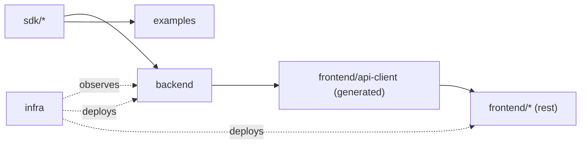

# AEP — Repository Design

> Produced from `prompts/promt2RepoDesign.md`. Builds on the module list and principles in
> [01-vision-and-principles.md](01-vision-and-principles.md) (modular monolith now,
> microservices-ready later; plugin architecture; provider abstraction). Design only — no
> implementation code, per the prompt's constraint.

## 1. Top-Level Layout

```
aep/
├── backend/            # the modular monolith (FastAPI) — one deployable
├── sdk/                 # publishable plugin-interface packages (provider, agent, evaluator)
├── frontend/            # React + TypeScript dashboard
├── infra/                # Docker, Kubernetes, observability config
├── docs/                # architecture, API, ADRs, runbooks
├── examples/            # reference plugins built against the SDKs
├── scripts/             # repo-local dev/CI tooling (not application code)
├── .github/             # CI workflows
└── README.md
```

Rationale for the split: `backend/`, `frontend/`, and `sdk/` are three independently versionable,
independently testable units. `sdk/` is deliberately separated from `backend/` — see §5 — because
third parties (internal teams writing plugins) depend on `sdk/` but must never depend on
`backend/` internals.

## 2. `backend/` — The Modular Monolith

```
backend/
├── pyproject.toml
├── src/aep/
│   ├── main.py                  # composition root: wires modules into one FastAPI app
│   ├── core/
│   │   ├── config.py            # settings (env-driven, typed via pydantic-settings)
│   │   ├── db.py                # SQLAlchemy session/engine management
│   │   ├── events.py             # domain event bus (publish/subscribe contract, ADR-004)
│   │   ├── security.py          # OAuth/JWT verification, RBAC dependencies
│   │   ├── observability.py      # OpenTelemetry setup, structured logging
│   │   └── errors.py            # shared exception types, HTTP error mapping
│   ├── modules/
│   │   ├── projects/             # Project Service
│   │   ├── task_memory/          # Task Memory Service
│   │   ├── context_builder/      # Context Builder
│   │   ├── orchestrator/         # Agent Orchestrator
│   │   ├── prompt_library/       # Prompt Library
│   │   ├── evaluation/           # Evaluation Framework (host side — see sdk/aep-eval-sdk)
│   │   ├── metrics/              # Metrics Service
│   │   ├── auth/                 # Authentication Service
│   │   └── dashboard_api/        # Dashboard API (composes the above; no own domain logic)
│   ├── providers/                # registered Model Provider SDK implementations (Claude, OpenAI, Gemini, Vertex)
│   └── plugins/                  # plugin discovery/registry (loads sdk-conformant plugins at startup)
├── alembic/                      # DB migrations
└── tests/
    ├── unit/                     # per-module, no DB/network
    ├── integration/               # real DB, mocked providers
    └── e2e/                       # full pipeline against a test environment
```

### Each `modules/<name>/` follows the same internal shape

```
modules/projects/
├── api/            # FastAPI routers — request/response schemas only, no business logic
├── domain/         # entities, value objects, domain exceptions
├── services/       # use-case orchestration (application layer)
├── repository/     # SQLAlchemy models + data access, implements a domain-defined interface
└── __init__.py     # the module's public surface — everything else is private to the module
```

This is a ports-and-adapters shape repeated identically per module, which is what makes each
module independently testable (per the testability principle) and independently extractable into
a microservice later (per ADR-001) — the `api/` and `repository/` layers are exactly what get
replaced by an HTTP client and a remote DB respectively when a module is split out.

### Responsibility / Ownership / Dependencies / Guidelines

| Folder | Responsibility | Owner | May depend on | Coding guidelines |
|---|---|---|---|---|
| `core/` | Cross-cutting infra: config, DB session, event bus, security, observability | Platform team | nothing under `modules/` | No business logic. Anything here is usable by every module without creating a module-to-module coupling. |
| `modules/*` | One business capability each (§1 of the vision doc) | The team that owns that capability | `core/`, `sdk/*` interfaces, its own submodules | Never import another module's `domain/` or `repository/` directly. Cross-module calls go through the other module's `services/` public interface or through `core/events`. |
| `modules/*/api/` | HTTP contract | Module owner | `services/` in the same module only | Pydantic schemas mirror the API design doc exactly; no DB or provider calls in this layer. |
| `modules/*/domain/` | Business rules, invariants | Module owner | nothing (pure Python) | Zero framework imports (no FastAPI, no SQLAlchemy) — keeps this layer unit-testable with no fixtures. |
| `modules/*/services/` | Use-case orchestration | Module owner | own `domain/`, own `repository/` interface, `core/events` | This is where transactions and multi-step workflows live; thin by design. |
| `modules/*/repository/` | Persistence | Module owner | `core/db` only | SQLAlchemy models live here, not in `domain/`, so domain stays framework-free. |
| `providers/` | Model Provider SDK implementations (Claude/OpenAI/Gemini/Vertex) | Platform team | `sdk/aep-provider-sdk` interface only | No module under `modules/*` may import a specific provider directly — always through the SDK interface (ADR-002). |
| `plugins/` | Discovers and registers provider/agent/evaluator plugins at boot | Platform team | `sdk/*` interfaces | Registration only; must not contain business logic. |
| `tests/unit` | Fast, isolated | Each module owns its subtree | mirrors `src/` structure | No network, no real DB, no real LLM calls. |
| `tests/integration` | Cross-module, real DB | Platform team + module owners | test containers | Providers are mocked/faked; DB is real. |
| `tests/e2e` | Full pipeline (§5 of vision doc) | Platform team | staging-like environment | Runs against the actual flow: Project → Feature → ... → Merge. |

## 3. `sdk/` — Publishable Plugin Interfaces

```
sdk/
├── aep-provider-sdk/     # Model Provider plugin interface (ADR-002)
├── aep-agent-sdk/         # Agent plugin interface (see prompt5-AgentSDK design)
└── aep-eval-sdk/          # Evaluator plugin interface (see prompt7-Eval design)
```

Each is its own Python package (own `pyproject.toml`, own version, own changelog) so an external
or internal team can `pip install aep-provider-sdk` and build a provider plugin without pulling in
`backend/`. `backend/` depends on all three; none of the three ever depend on `backend/`. This
one-directional dependency is what makes "plugin, not fork" possible — a plugin author only ever
sees an abstract interface, never the orchestrator's internals.

**Owner:** Platform team (breaking changes here are breaking changes for every plugin author —
treated with the same care as a public API).

## 4. `frontend/`

```
frontend/
├── package.json
├── src/
│   ├── app/               # routing, providers, shell layout
│   ├── features/          # one folder per Dashboard screen (see prompt8-Dashboard design)
│   ├── components/         # shared, screen-agnostic UI components
│   ├── api-client/         # generated from the backend's OpenAPI spec — never hand-written
│   └── theme/              # MUI theme tokens
└── tests/
```

**Ownership:** Frontend team. **Dependencies:** `api-client/` is the *only* thing that talks to
`backend/`, and it is generated, not hand-written, so the frontend can never silently drift from
the API design doc. **Guideline:** a `features/*` folder may not import another `features/*`
folder directly — shared code goes in `components/`, mirroring the module-isolation rule in
`backend/`.

## 5. `infra/`

```
infra/
├── docker/               # Dockerfiles, docker-compose for local dev
├── k8s/                  # manifests/helm charts for deployment
└── observability/        # OTel collector config, Prometheus rules, Grafana dashboards
```

**Ownership:** Platform/DevOps. **Dependencies:** none on application code — infra config
references image tags and env vars, never imports Python/TS source. **Guideline:** every service
in `backend/modules/*` that the ops team needs to observe must ship its own Grafana dashboard
definition here, not an ad hoc one built in the Grafana UI.

## 6. `docs/`

```
docs/
├── architecture/         # this document and its siblings (numbered, sequential)
├── api/                  # generated/maintained OpenAPI specs
├── adr/                  # standalone Architecture Decision Records as they accumulate post-v1
└── runbooks/             # operational: on-call, incident response, deploy/rollback
```

**Ownership:** Whoever makes the decision writes the doc — no central docs team. **Guideline:**
architecture docs are numbered and additive (never renumbered/deleted), matching how this series
of design prompts is being produced.

## 7. `examples/`

```
examples/
├── custom-provider-plugin/    # minimal provider built against sdk/aep-provider-sdk
├── custom-agent/               # minimal agent built against sdk/aep-agent-sdk
└── custom-evaluator/            # minimal evaluator built against sdk/aep-eval-sdk
```

**Ownership:** Platform team, kept in lockstep with the SDKs (CI fails if an example stops
compiling against the current SDK version — this is what actually keeps SDK docs honest).
**Dependencies:** `sdk/*` only, never `backend/` — an example must build the same way an external
plugin author's project would.

## 8. `scripts/` and `.github/`

`scripts/` holds repo-local dev ergonomics (bootstrap, lint-all, migration helpers) — never
imported by application code. `.github/` holds CI workflow definitions: lint/typecheck/unit tests
per changed package (`backend/`, each `sdk/*`, `frontend/`), integration tests on merge to main,
and an example-plugins build check.

## 9. Cross-Repo Dependency Rules (Summary)



- `sdk/*` has **zero** dependencies on `backend/`, `frontend/`, or `infra/`.
- `backend/` depends on `sdk/*`; nothing depends on `backend/` except `frontend/` (indirectly, via
  the generated client) and `infra/` (as a deploy/observe target, not a code import).
- `examples/*` depends only on `sdk/*` — this is what proves the SDK boundary is real.
- Within `backend/`, `modules/*` never import each other directly (§2); within `frontend/`,
  `features/*` never import each other directly (§4). Both rules exist for the same reason:
  keeping every future extraction point (module → microservice, feature → micro-frontend) real
  today rather than aspirational.

## 10. Python Packaging Notes

- `backend/` and each `sdk/aep-*-sdk/` are separate installable packages (`pyproject.toml` each,
  `src/` layout) so versioning and dependency resolution are independent — a provider SDK bump
  should never force a backend redeploy and vice versa.
- Internal-only code lives under `src/aep/...`; anything meant for external plugin authors lives
  under the relevant `sdk/aep-*-sdk/src/...` package with its own distinct top-level import name
  (e.g. `aep_provider_sdk`), so a plugin author's import statements can never accidentally reach
  into backend internals even by typo.

## 11. Out of Scope Here

This document is repository *structure* only. It does not define: the DB schema (next design
doc), REST API contracts, the Agent/Provider/Eval SDK interfaces themselves, or coding-style rules
beyond the dependency/ownership rules above — those belong to their own staged prompts.
