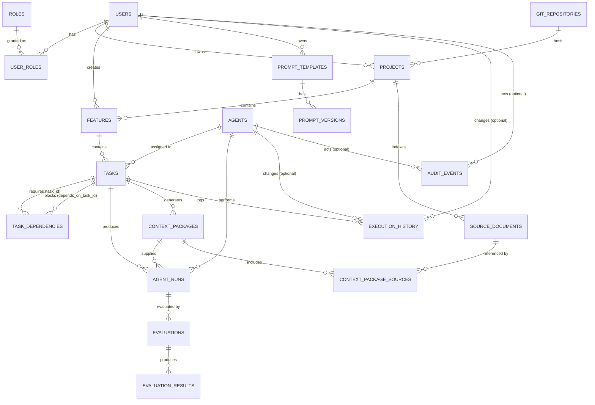

# AEP — Database Schema Design

> Produced from `prompts/promt3DBDesign.md`. Implements the persistence layer for the modules in
> [01-vision-and-principles.md](01-vision-and-principles.md) and lives under `backend/alembic` /
> `backend/src/aep/modules/*/repository` per [02-repo-design.md](02-repo-design.md). Design only —
> no application code.

## 0. Conventions Used Throughout

- Every table has a `UUID` primary key named `id`, generated app-side (`uuidv7`/`gen_random_uuid()`)
  so IDs are creatable before an insert and are naturally time-sortable.
- Every table has `created_at TIMESTAMPTZ NOT NULL DEFAULT now()`; tables whose rows are mutated
  after creation also have `updated_at TIMESTAMPTZ NOT NULL DEFAULT now()`. Append-only tables
  (`audit_events`, `execution_history`, `evaluation_results`, `metrics`) intentionally have no
  `updated_at` — they are never updated, only inserted, which is itself part of the auditability
  guarantee from the vision doc.
- Enum-like columns are `VARCHAR` + `CHECK` rather than native Postgres `ENUM` types, so adding a
  new status/type value is a constraint migration, not a type migration — cheaper and safer under
  concurrent deploys.
- Three tables appear here that the prompt's entity list didn't name explicitly —
  **`user_roles`**, **`context_package_sources`**, and **`refresh_tokens`** — the first two
  because `User`↔`Role` and `ContextPackage`↔`SourceDocument` are many-to-many relationships that
  need a join table to exist at all; the third because implementing the Authentication Service
  surfaced a real need for one (individually revocable sessions). All three are called out
  separately in §16.

## 1. `users`

**Why it exists:** identity anchor for every human actor in the system — the thing Auth,
Audit, and approval gates all point back to.

| Column | Type | Constraints |
|---|---|---|
| id | UUID | PK |
| email | VARCHAR(255) | NOT NULL, UNIQUE |
| display_name | VARCHAR(255) | NOT NULL |
| auth_provider | VARCHAR(50) | NOT NULL |
| auth_subject | VARCHAR(255) | NOT NULL |
| status | VARCHAR(20) | NOT NULL, DEFAULT `'active'`, CHECK IN (`active`,`disabled`) |
| created_at | TIMESTAMPTZ | NOT NULL, DEFAULT now() |
| updated_at | TIMESTAMPTZ | NOT NULL, DEFAULT now() |

**Indexes:** UNIQUE(`email`); UNIQUE(`auth_provider`, `auth_subject`).
**FKs:** none (root entity).

## 2. `roles`

**Why it exists:** the fixed vocabulary of permission levels (RBAC), kept separate from `users`
so role definitions can be audited and changed independently of any one user.

| Column | Type | Constraints |
|---|---|---|
| id | UUID | PK |
| name | VARCHAR(50) | NOT NULL, UNIQUE |
| description | TEXT | NULL |
| created_at | TIMESTAMPTZ | NOT NULL, DEFAULT now() |

**Indexes:** UNIQUE(`name`). **FKs:** none.

## 3. `git_repositories`

**Why it exists:** a Project's code lives somewhere; this decouples "which VCS/repo" from the
Project entity so a repo's connection details can be rotated or re-hosted without touching every
Project row semantics, and so `SourceDocument`/PR references have a stable parent.

| Column | Type | Constraints |
|---|---|---|
| id | UUID | PK |
| name | VARCHAR(255) | NOT NULL |
| url | VARCHAR(500) | NOT NULL, UNIQUE |
| provider | VARCHAR(50) | NOT NULL, CHECK IN (`github`,`gitlab`,`bitbucket`,`other`) |
| default_branch | VARCHAR(255) | NOT NULL, DEFAULT `'main'` |
| created_at | TIMESTAMPTZ | NOT NULL, DEFAULT now() |
| updated_at | TIMESTAMPTZ | NOT NULL, DEFAULT now() |

**Indexes:** UNIQUE(`url`). **FKs:** none.

## 4. `projects`

**Why it exists:** the top-level unit of ownership and billing/metrics rollup — the root of the
Project → Feature → Task hierarchy described in the vision doc's SDLC flow.

| Column | Type | Constraints |
|---|---|---|
| id | UUID | PK |
| name | VARCHAR(255) | NOT NULL |
| slug | VARCHAR(100) | NOT NULL, UNIQUE |
| description | TEXT | NULL |
| git_repository_id | UUID | NULL, FK → `git_repositories(id)` |
| owner_user_id | UUID | NOT NULL, FK → `users(id)` |
| status | VARCHAR(20) | NOT NULL, DEFAULT `'active'`, CHECK IN (`active`,`archived`) |
| created_at | TIMESTAMPTZ | NOT NULL, DEFAULT now() |
| updated_at | TIMESTAMPTZ | NOT NULL, DEFAULT now() |

**Indexes:** UNIQUE(`slug`); INDEX(`owner_user_id`); INDEX(`git_repository_id`).
**FKs:** `git_repository_id` → `git_repositories(id)` ON DELETE SET NULL;
`owner_user_id` → `users(id)` ON DELETE RESTRICT (a project must always have a resolvable owner).

## 5. `features`

**Why it exists:** the human-authored unit of intent within a Project — what the Task Graph is
generated *from* (vision doc §5, step "Create Feature → Generate Task Graph").

| Column | Type | Constraints |
|---|---|---|
| id | UUID | PK |
| project_id | UUID | NOT NULL, FK → `projects(id)` |
| title | VARCHAR(255) | NOT NULL |
| description | TEXT | NULL |
| status | VARCHAR(20) | NOT NULL, DEFAULT `'draft'`, CHECK IN (`draft`,`in_progress`,`in_review`,`done`,`cancelled`) |
| created_by | UUID | NOT NULL, FK → `users(id)` |
| created_at | TIMESTAMPTZ | NOT NULL, DEFAULT now() |
| updated_at | TIMESTAMPTZ | NOT NULL, DEFAULT now() |

**Indexes:** INDEX(`project_id`, `status`); INDEX(`created_by`).
**FKs:** `project_id` → `projects(id)` ON DELETE CASCADE; `created_by` → `users(id)` ON DELETE RESTRICT.

## 6. `tasks`

**Why it exists:** the atomic unit of agent-executable work — the node type in the Task Graph,
and the entity every Agent Run, Context Package, and evaluation ultimately traces back to.

| Column | Type | Constraints |
|---|---|---|
| id | UUID | PK |
| feature_id | UUID | NOT NULL, FK → `features(id)` |
| title | VARCHAR(255) | NOT NULL |
| description | TEXT | NULL |
| task_type | VARCHAR(50) | NOT NULL, CHECK IN (`plan`,`architect`,`code`,`test`,`review`,`document`,`security`,`evaluate`) |
| status | VARCHAR(20) | NOT NULL, DEFAULT `'pending'`, CHECK IN (`pending`,`ready`,`running`,`blocked`,`evaluating`,`awaiting_approval`,`approved`,`rejected`,`merged`,`failed`,`cancelled`) |
| assigned_agent_id | UUID | NULL, FK → `agents(id)` |
| priority | SMALLINT | NOT NULL, DEFAULT 0 |
| created_at | TIMESTAMPTZ | NOT NULL, DEFAULT now() |
| updated_at | TIMESTAMPTZ | NOT NULL, DEFAULT now() |

**Indexes:** INDEX(`feature_id`, `status`); INDEX(`assigned_agent_id`); INDEX(`status`, `priority`)
(drives the Orchestrator's scheduling query).
**FKs:** `feature_id` → `features(id)` ON DELETE CASCADE; `assigned_agent_id` → `agents(id)` ON DELETE SET NULL.

## 7. `task_dependencies`

**Why it exists:** makes the Task Graph an actual graph — encodes "this task cannot start until
that one finishes," which is what lets the Orchestrator compute readiness instead of relying on
manual sequencing.

| Column | Type | Constraints |
|---|---|---|
| id | UUID | PK |
| task_id | UUID | NOT NULL, FK → `tasks(id)` |
| depends_on_task_id | UUID | NOT NULL, FK → `tasks(id)` |
| dependency_type | VARCHAR(20) | NOT NULL, DEFAULT `'blocks'`, CHECK IN (`blocks`,`informs`) |
| created_at | TIMESTAMPTZ | NOT NULL, DEFAULT now() |

**Indexes:** UNIQUE(`task_id`, `depends_on_task_id`); INDEX(`depends_on_task_id`).
**FKs:** both → `tasks(id)` ON DELETE CASCADE.
**Constraints:** CHECK(`task_id <> depends_on_task_id`) — a task cannot depend on itself.
Cycle-freedom (no A→B→A) is a graph invariant enforced by the Task Memory Service at write time,
not expressible as a single-row SQL constraint.

## 8. `agents`

**Why it exists:** the catalog of registered agent implementations (PlannerAgent, CodingAgent,
etc. — per the Agent SDK design) available to be assigned to a task; separates "what agent types
exist and are enabled" from "what an agent did," which is `agent_runs`.

| Column | Type | Constraints |
|---|---|---|
| id | UUID | PK |
| name | VARCHAR(100) | NOT NULL |
| agent_type | VARCHAR(50) | NOT NULL, CHECK IN (`planner`,`architect`,`coding`,`testing`,`review`,`documentation`,`security`,`evaluation`) |
| version | VARCHAR(50) | NOT NULL |
| is_enabled | BOOLEAN | NOT NULL, DEFAULT true |
| config | JSONB | NOT NULL, DEFAULT `'{}'` |
| created_at | TIMESTAMPTZ | NOT NULL, DEFAULT now() |
| updated_at | TIMESTAMPTZ | NOT NULL, DEFAULT now() |

**Indexes:** UNIQUE(`name`, `version`); INDEX(`agent_type`) WHERE `is_enabled` (partial index —
the Orchestrator only ever queries enabled agents by type).
**FKs:** none.

## 9. `agent_runs`

**Why it exists:** one row per actual execution attempt of an agent against a task — the record
that cost, latency, and evaluation all attach to; the difference between `tasks.status` (where the
work stands) and `agent_runs` (every attempt made to get it there, including failed/retried ones).

| Column | Type | Constraints |
|---|---|---|
| id | UUID | PK |
| agent_id | UUID | NOT NULL, FK → `agents(id)` |
| task_id | UUID | NOT NULL, FK → `tasks(id)` |
| context_package_id | UUID | NULL, FK → `context_packages(id)` |
| provider | VARCHAR(50) | NOT NULL |
| model_name | VARCHAR(100) | NOT NULL |
| status | VARCHAR(20) | NOT NULL, DEFAULT `'queued'`, CHECK IN (`queued`,`running`,`succeeded`,`failed`,`cancelled`,`retrying`) |
| attempt_number | SMALLINT | NOT NULL, DEFAULT 1 |
| started_at | TIMESTAMPTZ | NULL |
| completed_at | TIMESTAMPTZ | NULL |
| input_tokens | INTEGER | NULL |
| output_tokens | INTEGER | NULL |
| cost_usd | NUMERIC(12,6) | NULL |
| error_message | TEXT | NULL |
| created_at | TIMESTAMPTZ | NOT NULL, DEFAULT now() |

**Indexes:** INDEX(`task_id`, `status`); INDEX(`agent_id`); INDEX(`created_at`) (cost/metrics
rollups scan by time).
**FKs:** `agent_id` → `agents(id)` ON DELETE RESTRICT; `task_id` → `tasks(id)` ON DELETE CASCADE;
`context_package_id` → `context_packages(id)` ON DELETE SET NULL.
**Constraints:** CHECK(`attempt_number >= 1`); CHECK(`completed_at IS NULL OR completed_at >= started_at`).

## 10. `prompt_templates`

**Why it exists:** the stable, named identity of a reusable prompt (e.g. "coding-agent-system-prompt"),
independent of any single version's text — lets agents reference "which prompt" without pinning to
"which revision" until execution time.

| Column | Type | Constraints |
|---|---|---|
| id | UUID | PK |
| name | VARCHAR(255) | NOT NULL, UNIQUE |
| description | TEXT | NULL |
| owner_user_id | UUID | NOT NULL, FK → `users(id)` |
| created_at | TIMESTAMPTZ | NOT NULL, DEFAULT now() |
| updated_at | TIMESTAMPTZ | NOT NULL, DEFAULT now() |

**Indexes:** UNIQUE(`name`). **FKs:** `owner_user_id` → `users(id)` ON DELETE RESTRICT.

## 11. `prompt_versions`

**Why it exists:** immutable, individually-referenceable revisions of a template — this is what
makes prompt changes auditable and lets an `agent_run` or `evaluation` pin to the exact prompt text
that produced a given output, which is required for reproducing/debugging a bad result.

| Column | Type | Constraints |
|---|---|---|
| id | UUID | PK |
| prompt_template_id | UUID | NOT NULL, FK → `prompt_templates(id)` |
| version_number | INTEGER | NOT NULL |
| content | TEXT | NOT NULL |
| variables | JSONB | NOT NULL, DEFAULT `'[]'` |
| is_active | BOOLEAN | NOT NULL, DEFAULT false |
| created_by | UUID | NOT NULL, FK → `users(id)` |
| created_at | TIMESTAMPTZ | NOT NULL, DEFAULT now() |

**Indexes:** UNIQUE(`prompt_template_id`, `version_number`); partial UNIQUE
(`prompt_template_id`) WHERE `is_active` — guarantees at most one active version per template at
the database level, not just in application code.
**FKs:** `prompt_template_id` → `prompt_templates(id)` ON DELETE CASCADE; `created_by` →
`users(id)` ON DELETE RESTRICT. Rows are never updated after insert (immutability, see §0).

## 12. `context_packages`

**Why it exists:** the Context Builder's output artifact — the actual bundle of context handed to
an agent for one run. Persisting it (rather than building and discarding) is what makes "why did
the agent write this" reconstructable after the fact.

| Column | Type | Constraints |
|---|---|---|
| id | UUID | PK |
| task_id | UUID | NOT NULL, FK → `tasks(id)` |
| token_count | INTEGER | NOT NULL |
| ranking_algorithm_version | VARCHAR(50) | NOT NULL |
| generated_at | TIMESTAMPTZ | NOT NULL, DEFAULT now() |
| created_at | TIMESTAMPTZ | NOT NULL, DEFAULT now() |

**Indexes:** INDEX(`task_id`). **FKs:** `task_id` → `tasks(id)` ON DELETE CASCADE.
**Constraints:** CHECK(`token_count >= 0`).

## 13. `source_documents`

**Why it exists:** the catalog of everything the Context Builder can draw from — source files,
architecture docs, coding standards, API specs, PRs, dependency graphs, prior evaluations, prompt
templates (per the Context Builder design's input list) — indexed once per project and reused
across many context packages rather than re-fetched per task.

| Column | Type | Constraints |
|---|---|---|
| id | UUID | PK |
| project_id | UUID | NOT NULL, FK → `projects(id)` |
| doc_type | VARCHAR(50) | NOT NULL, CHECK IN (`source_file`,`architecture_doc`,`coding_standard`,`api_spec`,`pull_request`,`dependency_graph`,`evaluation_history`,`prompt_template`) |
| uri | VARCHAR(1000) | NOT NULL |
| content_hash | VARCHAR(64) | NOT NULL |
| last_indexed_at | TIMESTAMPTZ | NULL |
| created_at | TIMESTAMPTZ | NOT NULL, DEFAULT now() |
| updated_at | TIMESTAMPTZ | NOT NULL, DEFAULT now() |

**Indexes:** UNIQUE(`project_id`, `uri`); INDEX(`project_id`, `doc_type`).
**FKs:** `project_id` → `projects(id)` ON DELETE CASCADE.
**Constraints:** `content_hash` lets the Context Builder skip re-embedding/re-ranking unchanged
documents — a cache-invalidation key, not just metadata.

## 14. `evaluations`

**Why it exists:** one row per evaluator invocation against an agent run (per the Evaluation
Framework's plugin model — DeepEval, Promptfoo, LLM-judge, static analysis, etc. each produce
their own `evaluations` row) — the join point between "an agent produced output" and "did it pass
the quality gate."

| Column | Type | Constraints |
|---|---|---|
| id | UUID | PK |
| agent_run_id | UUID | NOT NULL, FK → `agent_runs(id)` |
| evaluator_type | VARCHAR(50) | NOT NULL, CHECK IN (`deepeval`,`promptfoo`,`llm_judge`,`braintrust`,`langfuse`,`unit_test`,`integration_test`,`security_scan`,`static_analysis`,`coverage`,`performance`,`architecture_rules`) |
| status | VARCHAR(20) | NOT NULL, DEFAULT `'pending'`, CHECK IN (`pending`,`running`,`passed`,`failed`,`error`) |
| started_at | TIMESTAMPTZ | NULL |
| completed_at | TIMESTAMPTZ | NULL |
| created_at | TIMESTAMPTZ | NOT NULL, DEFAULT now() |

**Indexes:** INDEX(`agent_run_id`, `evaluator_type`).
**FKs:** `agent_run_id` → `agent_runs(id)` ON DELETE CASCADE.

## 15. `evaluation_results`

**Why it exists:** an `evaluation` can produce multiple scored metrics (e.g. DeepEval alone emits
faithfulness, relevance, and toxicity scores) — this table normalizes those into individually
queryable rows instead of one opaque JSON blob per evaluation, so the quality gate and the
Dashboard's Evaluations screen can filter/sort by metric.

| Column | Type | Constraints |
|---|---|---|
| id | UUID | PK |
| evaluation_id | UUID | NOT NULL, FK → `evaluations(id)` |
| metric_name | VARCHAR(100) | NOT NULL |
| score | NUMERIC(6,4) | NOT NULL |
| threshold | NUMERIC(6,4) | NULL |
| passed | BOOLEAN | NOT NULL |
| details | JSONB | NOT NULL, DEFAULT `'{}'` |
| created_at | TIMESTAMPTZ | NOT NULL, DEFAULT now() |

**Indexes:** INDEX(`evaluation_id`); INDEX(`metric_name`, `passed`) (drives quality-gate
aggregation queries). **FKs:** `evaluation_id` → `evaluations(id)` ON DELETE CASCADE. Append-only.

## 16. `user_roles`, `context_package_sources`, and `refresh_tokens` (implied tables)

None of the three were in the prompt's original entity list. `user_roles` and
`context_package_sources` are many-to-many join tables that can't be modeled without existing at
all; `refresh_tokens` is a genuinely new table, added while implementing the Authentication
Service (backend `modules/auth`) — `POST /auth/logout` (docs/architecture/04-api-design.md §1)
needs to revoke one specific refresh token, which requires somewhere to revoke it *from*. A
stateless refresh token (e.g. a long-lived JWT) can't be individually revoked, only left to
expire — that would make "logout" a UI-only gesture with no actual effect, which defeats the
point of the endpoint existing.

**`user_roles`** — a user can hold more than one role (e.g. `engineer` + `reviewer`), and a role
applies to more than one user.

| Column | Type | Constraints |
|---|---|---|
| user_id | UUID | NOT NULL, FK → `users(id)` ON DELETE CASCADE |
| role_id | UUID | NOT NULL, FK → `roles(id)` ON DELETE CASCADE |
| granted_at | TIMESTAMPTZ | NOT NULL, DEFAULT now() |
| granted_by | UUID | NULL, FK → `users(id)` ON DELETE SET NULL |

**PK:** (`user_id`, `role_id`).

**`context_package_sources`** — a context package includes many source documents, and a source
document (e.g. a coding-standards doc) is reused across many context packages; this table also
carries the ranking output the Context Builder design calls for (relevance score, rank, whether it
made the token budget).

| Column | Type | Constraints |
|---|---|---|
| id | UUID | PK |
| context_package_id | UUID | NOT NULL, FK → `context_packages(id)` ON DELETE CASCADE |
| source_document_id | UUID | NOT NULL, FK → `source_documents(id)` ON DELETE RESTRICT |
| relevance_score | NUMERIC(6,4) | NOT NULL |
| rank | SMALLINT | NOT NULL |
| included | BOOLEAN | NOT NULL, DEFAULT true |
| token_count | INTEGER | NOT NULL |

**Indexes:** UNIQUE(`context_package_id`, `source_document_id`); INDEX(`context_package_id`, `rank`).
`included = false` rows are kept (not deleted) so the ranking algorithm's exclusion decisions are
themselves auditable/debuggable, per the Context Builder design's "explain ranking" requirement.

**`refresh_tokens`** — one row per issued refresh token, so a specific one can be looked up and
revoked at logout without invalidating a user's other active sessions (e.g. logging out on one
device shouldn't sign you out everywhere).

| Column | Type | Constraints |
|---|---|---|
| id | UUID | PK |
| user_id | UUID | NOT NULL, FK → `users(id)` ON DELETE CASCADE |
| token_hash | VARCHAR(64) | NOT NULL, UNIQUE |
| expires_at | TIMESTAMPTZ | NOT NULL |
| revoked_at | TIMESTAMPTZ | NULL |
| created_at | TIMESTAMPTZ | NOT NULL, DEFAULT now() |

**Indexes:** UNIQUE(`token_hash`); INDEX(`user_id`).
**FKs:** `user_id` → `users(id)` ON DELETE CASCADE.
**Constraints:** only `token_hash` (a SHA-256 digest of the opaque token) is ever stored, never
the raw token — a leaked database dump must not hand out usable credentials. `revoked_at IS NULL`
means still valid (subject to `expires_at`); logout sets it rather than deleting the row, so a
revoked-token reuse attempt (e.g. a stolen token replayed after logout) is distinguishable from a
token that never existed, which matters for incident investigation.

## 17. `audit_events`

**Why it exists:** the enterprise compliance trail — a single append-only stream of "who/what did
X to entity Y," independent of any one module's own tables, so a security or compliance review
never has to reconstruct history by joining across every module.

| Column | Type | Constraints |
|---|---|---|
| id | UUID | PK |
| actor_user_id | UUID | NULL, FK → `users(id)` ON DELETE SET NULL |
| actor_agent_id | UUID | NULL, FK → `agents(id)` ON DELETE SET NULL |
| event_type | VARCHAR(100) | NOT NULL |
| entity_type | VARCHAR(50) | NOT NULL |
| entity_id | UUID | NOT NULL |
| payload | JSONB | NOT NULL, DEFAULT `'{}'` |
| created_at | TIMESTAMPTZ | NOT NULL, DEFAULT now() |

**Indexes:** INDEX(`entity_type`, `entity_id`); INDEX(`event_type`, `created_at`);
INDEX(`created_at`) (retention/purge jobs scan by age).
**Constraints:** CHECK(`actor_user_id IS NOT NULL OR actor_agent_id IS NOT NULL`) — every event
must be attributable to a human or an agent, never anonymous.
`entity_type`/`entity_id` is an intentionally polymorphic reference (no FK) — this table must be
able to reference rows in *any* module, including ones added later, without a schema change;
referential integrity here is an application-level guarantee, not a database one, which is the
one deliberate exception to "every relationship has a FK" in this schema.
**Operational note:** the application DB role should have `INSERT` but not `UPDATE`/`DELETE`
grants on this table — enforced at the database-permission level, not just by convention.

## 18. `metrics`

**Why it exists:** the raw time-series feed for the Metrics Service — cost, latency, token usage,
and quality-trend data points, kept separate from `audit_events` because metrics are numeric,
high-volume, and queried by aggregation (avg/sum/percentile over time), not by "what happened."

| Column | Type | Constraints |
|---|---|---|
| id | UUID | PK |
| metric_name | VARCHAR(100) | NOT NULL |
| entity_type | VARCHAR(50) | NOT NULL |
| entity_id | UUID | NOT NULL |
| value | NUMERIC(18,6) | NOT NULL |
| unit | VARCHAR(20) | NULL |
| recorded_at | TIMESTAMPTZ | NOT NULL, DEFAULT now() |

**Indexes:** INDEX(`metric_name`, `recorded_at`); INDEX(`entity_type`, `entity_id`).
Like `audit_events`, `entity_type`/`entity_id` is polymorphic by design. **Operational note:**
this table is the one most likely to need partitioning by `recorded_at` (monthly) once volume
grows — flagged here, not solved here, per ADR-005's "Postgres is system of record" without
prescribing a specific scaling technique prematurely.

## 19. `execution_history`

**Why it exists:** specifically the Task state-machine transition log — distinct from the
general-purpose `audit_events` because this one has a narrow, fixed shape (`from_status` →
`to_status`) optimized for rendering the Task Graph's timeline/Gantt view in the Dashboard, rather
than for general compliance querying.

| Column | Type | Constraints |
|---|---|---|
| id | UUID | PK |
| task_id | UUID | NOT NULL, FK → `tasks(id)` |
| from_status | VARCHAR(20) | NULL |
| to_status | VARCHAR(20) | NOT NULL |
| changed_by_user_id | UUID | NULL, FK → `users(id)` ON DELETE SET NULL |
| changed_by_agent_id | UUID | NULL, FK → `agents(id)` ON DELETE SET NULL |
| reason | TEXT | NULL |
| created_at | TIMESTAMPTZ | NOT NULL, DEFAULT now() |

**Indexes:** INDEX(`task_id`, `created_at`).
**FKs:** `task_id` → `tasks(id)` ON DELETE CASCADE.
**Constraints:** CHECK(`changed_by_user_id IS NOT NULL OR changed_by_agent_id IS NOT NULL`).
Append-only, same rationale as `audit_events`.

## 20. Entity-Relationship Diagram

`metrics` is omitted from the diagram — its `entity_type`/`entity_id` columns are an intentional
polymorphic reference (§18), not a modeled FK relationship, so it has no fixed place in an ER graph.

## 21. Out of Scope Here

This document defines schema only. It does not define: migration tooling/process, query patterns
or the ORM layer, retention/partitioning policy for `audit_events`/`metrics` (flagged, not solved,
in §17–18), or the REST API that sits in front of these tables — that belongs to the API design
doc.
