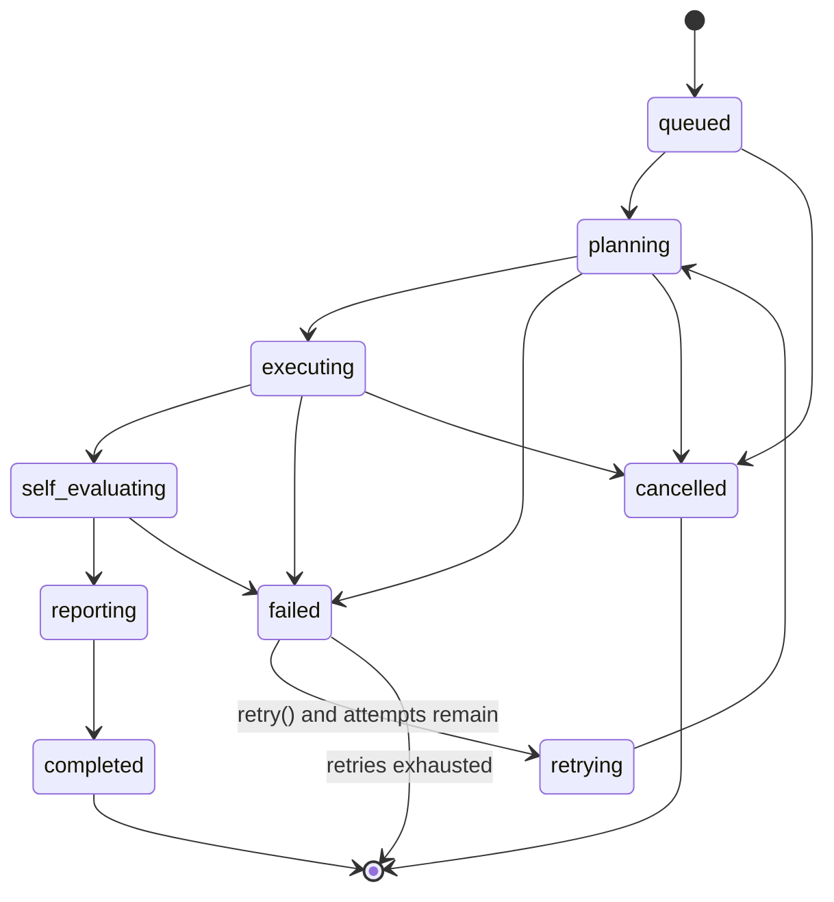

# AEP — Agent SDK Design

> Produced from `prompts/prompt5-AgentSDK.md`. Defines the contract published as
> `sdk/aep-agent-sdk` (per [02-repo-design.md](02-repo-design.md)), consumed by the Agent
> Orchestrator module and backing the `agents`/`agent_runs` tables
> ([03-db-design.md](03-db-design.md)) and the `POST /tasks/{taskId}/runs`,
> `/agent-runs/{runId}/events`, `/cancel`, `/retry` endpoints ([04-api-design.md](04-api-design.md)).
> Architecture only — interface *signatures* are shown to define the contract precisely, but no
> method bodies/business logic are implemented here, per the prompt's constraint.

## 1. Design Philosophy

An agent author (internal team building, say, a new `RefactoringAgent`) should only ever write
the four hook methods that encode actual judgment — `plan`, `execute`, `evaluate`, `report`.
Everything else every agent needs — async scheduling, retries, event publishing, structured
logging, metrics, cancellation, heartbeats — is cross-cutting and must not be reimplemented per
agent. This is the same "opinionated core, open edges" commitment from the vision doc, applied at
the agent level instead of the platform level.

## 2. The Base Agent Contract

```python
class BaseAgent(ABC):
    agent_id: UUID
    agent_type: AgentType          # planner | architect | coding | testing | review |
                                   # documentation | security | evaluation
    version: str
    config: dict

    # --- hook methods: implemented by subclasses, contain the actual agent logic ---
    @abstractmethod
    async def plan(self, context: TaskContext) -> Plan: ...

    @abstractmethod
    async def execute(self, plan: Plan, ctl: CancellationToken) -> ExecutionResult: ...

    @abstractmethod
    async def evaluate(self, result: ExecutionResult) -> SelfEvaluation: ...

    @abstractmethod
    async def report(self, result: ExecutionResult, self_eval: SelfEvaluation) -> AgentReport: ...

    # --- lifecycle methods: implemented once, final, on BaseAgent itself ---
    async def run(self, context: TaskContext) -> AgentReport: ...   # final — see §4
    async def cancel(self) -> None: ...                             # final — see §7
    async def retry(self) -> AgentReport: ...                       # final — see §6
    async def heartbeat(self) -> HeartbeatSignal: ...               # final — see §8
```

`plan`, `execute`, `evaluate`, `report` are `abstractmethod`s an agent subclass must implement.
`run`, `cancel`, `retry`, `heartbeat` are **not** overridable — they live on `BaseAgent` and are
what the SDK guarantees. This split is the single most important design decision in this document
(§4 explains why).

### 2.1 Supporting Types

| Type | Carries | Produced by |
|---|---|---|
| `TaskContext` | `task_id`, the Context Package contents (from the Context Builder), `prompt_version` to use | Orchestrator, passed into `run()` |
| `Plan` | ordered list of `PlanStep` (description, tool(s) it will use, estimated cost) | agent's `plan()` |
| `ExecutionResult` | artifacts (diff/patch, files changed, generated docs, logs), `input_tokens`/`output_tokens`/`cost_usd` | agent's `execute()` |
| `SelfEvaluation` | `passed: bool`, `confidence: float`, `notes: str` | agent's `evaluate()` |
| `AgentReport` | final summary: status, `ExecutionResult`, `SelfEvaluation`, timing | agent's `report()`, returned by `run()` |
| `CancellationToken` | a checkable/awaitable flag the running `execute()` must poll at safe checkpoints | `BaseAgent.run()` |
| `HeartbeatSignal` | `timestamp`, `progress_percent`, `message` | `BaseAgent.heartbeat()` |

## 3. Lifecycle State Machine



These fine-grained states exist only in the SDK's events/logs/SSE stream — they intentionally do
**not** each get their own `agent_runs.status` value. The DB column stays coarse
(`queued`/`running`/`succeeded`/`failed`/`cancelled`/`retrying`, per the DB design) because that's
all the Orchestrator's scheduling queries need; `planning`/`executing`/`self_evaluating`/`reporting`
all map to DB status `running`. Adding a new internal sub-state later (e.g. splitting `executing`
into `executing_tools` / `executing_llm_call`) is then an SDK/event change, not a database
migration — the two layers evolve independently on purpose.

## 4. `run()` — Template Method (ADR-A1)

`run()` is the single entry point the Orchestrator calls, and it is intentionally not overridable:

1. Publish `agent_run.queued` → `agent_run.planning`; call `plan(context)`.
2. Publish `agent_run.executing`; call `execute(plan, cancellation_token)`.
3. Publish `agent_run.self_evaluating`; call `evaluate(result)`.
4. Publish `agent_run.reporting`; call `report(result, self_eval)`.
5. Publish `agent_run.completed` (or `.failed` if any step raised).

Around every step, `run()` (not the subclass) handles: structured logging with
`agent_run_id`/`task_id`/OTel trace context attached automatically (§9), standard metrics emission
(§10), the retry decision on failure (§6), and checking the `CancellationToken` before advancing to
the next step (§7). **Why this is a template method and not, say, middleware/decorators the agent
author opts into:** decorators can be forgotten; a method a subclass cannot override, cannot be
bypassed. Cross-cutting guarantees the platform depends on (every run is logged, every run emits
cost metrics, every run is cancellable) must not be optional per agent.

## 5. Asynchronous Execution (ADR-A5)

Every lifecycle method is a coroutine (`async def`). Agent runs execute as tasks inside the
Orchestrator's async worker pool, not one OS thread/process per run.

**Why async over thread-per-run:** the actual work inside `plan()`/`execute()` is dominated by I/O
wait — LLM API calls, file reads, subprocess tool invocations, DB writes — not CPU. A single
Orchestrator worker process can hold hundreds of concurrently-awaiting agent runs cheaply under
`asyncio`; thread-per-run would hit OS thread-count limits at a fraction of that concurrency for no
benefit, since the threads would spend nearly all their time blocked on the same kind of I/O.

**Where CPU-bound work must happen anyway** (e.g. a SecurityAgent running a heavy static-analysis
tool): that work is dispatched to a subprocess/sandbox (§11) and awaited, not run inline on the
event loop — keeping the event loop itself non-blocking is a hard rule, not a suggestion, since one
blocking call stalls every other concurrently-running agent in the same worker.

## 6. Retries (ADR: retry policy)

`retry()` is final on `BaseAgent` and is driven by a `RetryPolicy` supplied via `config`:

| Field | Meaning |
|---|---|
| `max_attempts` | ceiling on `agent_runs.attempt_number` (DB design §9) |
| `backoff_base_seconds` / `backoff_multiplier` | exponential backoff between attempts |
| `retryable_error_types` | which raised error types make a failure eligible for retry at all |

**Retryable vs. terminal failures is a first-class distinction**, not "retry everything until
`max_attempts`": a provider timeout or rate-limit error is retryable; a config validation error or
an `evaluate()` self-check that fails because the plan itself was unsound is terminal — retrying it
would just reproduce the same failure and burn budget. Error types are:

- `RetryableAgentError` (transient — provider timeout, rate limit, tool sandbox unavailable)
- `TerminalAgentError` (deterministic — bad config, invalid context, self-evaluation hard-fail)
- `CancelledError` / `AgentTimeoutError` (not retried automatically — see §7/§8)

On a retryable failure, `run()` publishes `agent_run.retrying`, applies backoff, increments
`attempt_number`, and re-enters at `planning` (not `queued`) — re-planning is included in the retry
because the failure may mean the original plan was wrong given what execution revealed, not just
that execution needs re-running verbatim.

## 7. Cancellation (ADR-A2: cooperative, not preemptive)

`cancel()` sets the `CancellationToken` passed into `execute()`; it does **not** forcibly kill the
running coroutine. Agent implementations must poll the token at safe checkpoints (between plan
steps, between tool calls) and exit cleanly when it's set.

**Why cooperative over preemptive:** a `CodingAgent` mid-way through writing a multi-file patch or
a `TestingAgent` mid-way through a test run holds state (partial file writes, an open sandbox
session) that a hard kill could leave corrupted or orphaned. Cooperative cancellation lets the
agent reach a safe rollback/cleanup point first.

**Fallback:** if an agent doesn't respond to cancellation within a configured grace period (default
30s), the Orchestrator escalates to a hard kill of the underlying sandbox/container (§11) as a last
resort — this bounds the cost of a misbehaving or hung agent without making preemptive kill the
default, everyday path.

## 8. Heartbeats

`heartbeat()` emits a `HeartbeatSignal` on a fixed interval (default 15s, configurable) for the
duration of `execute()`. The Orchestrator treats a missed heartbeat window (default: 3 consecutive
misses) as a hung run and transitions it to `failed` with a `AgentTimeoutError`, eligible for retry
like any other retryable failure.

**Why a separate mechanism from logging:** log lines are unstructured and may not arrive during a
long silent tool call; a heartbeat is a cheap, guaranteed, fixed-shape signal specifically so
liveness detection doesn't depend on the agent's own logging discipline. This is also the signal
the SSE endpoint's `heartbeat` event (API design §5.6) forwards directly to the Dashboard.

## 9. Logging

`run()` binds `agent_run_id`, `task_id`, `agent_type`, and the current OpenTelemetry
trace/span ID to every log line emitted during that run, automatically — an agent author calls
`self.log.info(...)` and gets full correlation for free. This directly implements the
observability principle from the vision doc: a trace spans Context Build → Agent Run →
Evaluation, and logs from any stage are attributable back to that one trace without the agent
author doing anything.

## 10. Metrics

`run()` emits a fixed set of metrics into the Metrics Service (writing `metrics` rows, DB design
§18) around every run automatically: `agent_run.duration_ms`, `agent_run.input_tokens`,
`agent_run.output_tokens`, `agent_run.cost_usd`, `agent_run.attempt_number`,
`agent_run.self_eval_passed`. Agent authors may additionally call `self.emit_metric(name, value)`
for agent-type-specific metrics (e.g. a `TestingAgent` emitting `tests_generated_count`) — the base
set is guaranteed and not opt-in; custom metrics are additive.

## 11. Tool Execution & Sandbox Isolation (design note, not solved here)

`CodingAgent`, `TestingAgent`, and `SecurityAgent` execute tools (shell commands, file I/O, static
analysis binaries) as part of `execute()`. This tool execution runs inside a per-run
sandbox/container, never inside the Orchestrator's own process — an agent (or a prompt injection
that hijacks one) must not be able to reach the Orchestrator's filesystem, credentials, or other
concurrent runs. This is flagged as a hard architectural requirement here; the sandbox
provisioning mechanism itself (container-per-run vs. pooled sandboxes, on what infra) belongs to
the infra design, not this SDK doc.

## 12. Event Publishing

Every state transition in §3 publishes a domain event on `core.events` (ADR-004 from the vision
doc): `agent_run.queued`, `.planning`, `.executing`, `.self_evaluated`, `.reporting`, `.completed`,
`.failed`, `.cancelled`, `.retrying`, `.heartbeat`. Consumers, all independent of `BaseAgent` and of
each other:

- the SSE endpoint (API design §5.6) — live Dashboard updates
- Execution History writer — appends `execution_history` rows when the *task's* status changes as
  a consequence
- Metrics Service — some metrics are event-driven rather than emitted directly by `run()` (e.g.
  time-in-state)
- Audit Event writer — `agent_run.completed`/`.failed` on a task's final attempt is audit-relevant

## 13. Agent Types (Responsibility Only)

| Agent | Responsibility | Notable input | Notable output |
|---|---|---|---|
| `PlannerAgent` | Decomposes a Feature into a Task Graph | Feature + repo context | `Task[]` + `TaskDependency[]` (backs `task-graph:generate`, API design §3) |
| `ArchitectAgent` | Produces a design/interface decision for a task before code is written | Task + relevant source/architecture docs | An architecture note added to the task's context for downstream agents |
| `CodingAgent` | Writes/modifies code for a task | Context Package | A diff/patch — never a direct push, per the human-approval gate in the vision doc |
| `TestingAgent` | Writes and/or runs tests against a CodingAgent's output | The code diff | Test files and/or a test run result |
| `ReviewAgent` | LLM-driven code review pass (style, correctness, obvious defects) | The code diff | Review comments; a cheap pre-check, complementary to the Evaluation Framework (§14) |
| `DocumentationAgent` | Generates/updates docs for a merged or near-merged change | The code diff + existing docs | Doc updates (README, API docs, ADRs) |
| `SecurityAgent` | Threat-modeling / security-focused review of a proposed change | The code diff | Findings; feeds the Evaluation Framework's `security_scan` evaluator (§14) |
| `EvaluationAgent` | Wraps LLM-judge-style evaluation as an agent (multi-step, needs an LLM call) | An `agent_run`'s output | A `SelfEvaluation`-shaped judgment, submitted into the Evaluation Framework as an `llm_judge` evaluation |

## 14. Relationship to the Evaluation Framework (ADR-A3)

The Agent SDK's `evaluate()` and the Evaluation Framework (its own design doc, from
`prompt7-Eval.md`) are two different things that meet at one point, and conflating them is the
most likely design mistake here, so it's worth being explicit:

- **`evaluate()` is the agent's own cheap, immediate self-check** — "did I actually produce
  something coherent" — run inline, by the same agent, before it even calls `report()`. It is not
  authoritative and does not gate anything by itself.
- **The Evaluation Framework is the authoritative, pluggable quality gate** (DeepEval, Promptfoo,
  unit tests, security scans, etc., per `prompt7-Eval.md`) that runs *after* `report()`, against the
  completed `agent_run`, and is what `POST /tasks/{taskId}/approve` actually checks (API design §5,
  §7).
- Most evaluator types (`unit_test`, `static_analysis`, `coverage`, `security_scan`) are
  deterministic tools with no LLM call — they live entirely inside the Evaluation Framework's own
  plugin system and never need an `Agent` wrapper.
- `EvaluationAgent` exists specifically because `llm_judge`-style evaluation *is* itself an
  agentic, multi-step LLM interaction — so it's modeled as an agent whose `execute()` produces a
  judgment, which the Evaluation Framework then records as an `evaluations`/`evaluation_results` row
  like any other evaluator's output.

## 15. Registration

An agent implementation registers against `sdk/aep-agent-sdk`'s `BaseAgent` and is discovered by
`backend/src/aep/plugins` (per the repo design) at boot, which upserts a corresponding row into
`agents` (`name` + `version` unique, per DB design §8). Registration is additive — a new agent type
requires no Orchestrator code change, only a new plugin registration, matching the extensibility
principle from the vision doc.

## 16. Out of Scope Here

This document defines the agent lifecycle contract and cross-cutting guarantees only. It does not
define: the Evaluation Framework's own plugin architecture (next design doc), the Context Builder's
ranking algorithm that produces `TaskContext`'s content, the sandbox provisioning mechanism
mentioned in §11, or any concrete agent's internal prompting/tool-use logic.
