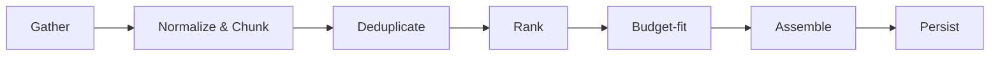

# AEP — Context Builder Service Design

> Produced from `prompts/promt6-COntextBuilder.md`. Implements the service behind
> `POST /tasks/{taskId}/context-packages` ([04-api-design.md](04-api-design.md) §4), persisting into
> `context_packages` / `context_package_sources` ([03-db-design.md](03-db-design.md) §12, §16, §13),
> and producing the `TaskContext` the Agent SDK's `plan()`/`execute()` consume
> ([05-agent-sdk.md](05-agent-sdk.md) §2.1). Design only — no implementation code, per the prompt's
> constraint; pseudocode below describes the algorithm, not a working implementation.

## 1. Contract

**Input:** a `task_id`, plus a `max_tokens` budget (API design §4, `POST .../context-packages`).
**Output:** a persisted `ContextPackage` — an ordered, deduplicated, budget-fitted, ranked bundle
of content, small enough to hand to whichever provider/model the Agent Orchestrator selects for
that run, and fully explainable after the fact (which sources were considered, which were used,
and why).

## 2. Pipeline



Each stage is a distinct, independently testable step (matching the testability principle from the
vision doc); no stage reaches back into an earlier one. §3–§8 cover them in order.

## 3. Gather

Eight source types, each pulled by its own gatherer, all normalized into the same internal
`RawChunk` shape (`text`, `source_document_id`, `doc_type`, `location`) before dedup/ranking sees
them:

| Source | Where it comes from | Notes |
|---|---|---|
| Relevant source files | The task's project git repository, filtered to files the task's description/diff scope references or that the dependency graph (below) reaches | Not the whole repo — see §7 |
| Architecture documents | `source_documents` where `doc_type = architecture_doc` for the project | These are the docs this very design series produces |
| Coding standards | `source_documents` where `doc_type = coding_standard` | Produced by `prompt9-CodingStd.md`'s output |
| API specifications | `source_documents` where `doc_type = api_spec` | The OpenAPI doc generated from [04-api-design.md](04-api-design.md) |
| Related pull requests | `source_documents` where `doc_type = pull_request`, filtered to ones touching the same file paths as the task, or linked to the same feature/branch | "Related" = path-overlap or explicit feature link, not full PR history |
| Dependency graph | Derived at gather-time from the repo's import/module graph, not stored per-task | Truncated to an N-hop neighborhood — see §7 |
| Previous evaluations | `evaluation_results` for prior `agent_runs` on this task (and, secondarily, similar tasks in the same feature) | High-value "don't repeat this mistake" signal — see §7.4 |
| Prompt templates | The active `prompt_versions` row for the template this agent type uses | Always included, never ranked/dropped — see §6 |

Gatherers run concurrently (they're independent I/O calls) and each returns a bounded number of
candidate chunks — a gatherer over-fetching and letting ranking/budgeting sort it out is cheaper
than a gatherer trying to be precise up front.

## 4. Normalize & Chunk (ADR-CB2)

Every gathered document is split into chunks before ranking — never ranked as a whole file/PR/doc.
Chunk boundaries follow structure where it exists (function/class for source files, section
headers for docs, hunk for PR diffs) and fall back to a fixed-size sliding window with overlap
otherwise.

**Why chunk-level, not document-level:** a 2,000-line source file is very often relevant to a task
through exactly one function. Ranking and budgeting at file granularity would force an all-or-
nothing include/exclude decision on the whole file — either wasting hundreds of irrelevant tokens
or dropping the one relevant function along with the rest. Chunk granularity lets the budget be
spent precisely.

## 5. Deduplicate (ADR-CB4)

Two tiers, applied in order:

1. **Exact dedup** — by `source_documents.content_hash` (DB design §13). If a document hasn't
   changed since it was last indexed, its existing chunks/embeddings are reused rather than
   recomputed; if two gatherers return the same document (e.g. a coding-standards doc that's also
   linked from a PR description), it's included once.
2. **Near-duplicate dedup** — chunks with cosine similarity above a threshold (e.g. `0.95`) against
   an already-kept chunk are dropped, keeping the higher-ranked one. This catches semantic overlap
   exact-hash can't: the same explanation copy-pasted across two docs, or a PR diff that
   reintroduces a chunk already present in the current source file.

Near-duplicate dedup runs **after** an initial coarse relevance pass (not against the full
candidate pool pairwise), since pairwise similarity across every gathered chunk is quadratic and
unnecessary — only chunks that survived gathering as plausibly relevant need deduplicating against
each other.

## 6. Rank (ADR-CB1)

Every remaining chunk gets one relevance score, a weighted combination of independent signals —
chosen over a single pure vector-similarity score specifically because relevance here isn't one
thing:

```
score(chunk) =
      w1 * semantic_similarity(chunk, task_description_embedding)
    + w2 * structural_proximity(chunk, task_dependency_subgraph)
    + w3 * recency_decay(chunk.updated_at)
    + w4 * doc_type_prior(chunk.doc_type)
    + w5 * failure_history_boost(chunk, task.previous_evaluations)
    + pinned_override(chunk)   // if set, short-circuits to max score
```

| Signal | What it captures | Why it's needed alongside the others |
|---|---|---|
| `semantic_similarity` | Embedding cosine similarity between the chunk and the task's description/title | Catches conceptual relevance text-matching alone would miss |
| `structural_proximity` | Graph distance (in hops) from the chunk's file to files the task is expected to touch | Catches relevance semantic similarity alone would miss — a directly-imported helper function may read nothing like the task description but is critical context |
| `recency_decay` | Exponential decay by `updated_at`/PR merge date | A stale architecture doc or an old superseded PR shouldn't outrank current code |
| `doc_type_prior` | A fixed baseline weight per `doc_type` | Coding standards and architecture docs are close to always relevant regardless of textual similarity to one task — this is what keeps them from getting starved out by more "on-topic"-looking source chunks |
| `failure_history_boost` | Whether this chunk (or the pattern it represents) was implicated in a prior failed `evaluation_result` for this task | Directly implements "explain ranking" — a chunk that caused a past failure is deliberately resurfaced, not just whatever's textually similar |
| `pinned_override` | A human or the PlannerAgent can pin a document as required for a task | Escape hatch — ranking is a heuristic, not a guarantee, and some context (e.g. a security requirement doc) must never be left to a score |

**Why a weighted linear combination and not a single learned/black-box relevance model:** every
signal and every weight is independently inspectable, and the persisted `relevance_score` +
`rank` + `included` per source (DB design §16) must be *explainable* to an engineer asking "why
wasn't X in the context this agent saw" — a linear combination of named signals answers that
question directly ("recency_decay was low, doc_type_prior gave it no boost"); a single opaque
embedding-similarity-only score or a trained ranker cannot, at v1, be interrogated the same way.
Weights (`w1..w5`) are configuration, tunable per project/task-type without a code change.

Prompt templates (§3, last row) are never scored — they're mandatory inclusions, appended after
ranking, not competing for budget with everything else.

## 7. Notes on Specific Signals

### 7.1 Structural Proximity / Dependency Graph (ADR-CB5)

The full project dependency graph is never included — only the **N-hop neighborhood** (default
`N=2`) around the files the task is expected to touch. Proximity beyond N hops decays to
negligible relevance for nearly all tasks, and including the full graph for a large repo would
both blow the token budget and drown out everything else. `structural_proximity` itself is
`1 / (1 + hop_distance)`, so distance beyond the N-hop cutoff would score near zero anyway — the
cutoff is a performance optimization on top of a score that already trends toward it.

### 7.2 Previous Evaluations

Pulled specifically from failed/low-scoring `evaluation_results` on this task's prior `agent_runs`
(DB design §14–15), and secondarily from similar tasks in the same feature. This is the mechanism
that keeps an agent from repeating a mistake on retry (Agent SDK §6): the retry's new context
package is not identical to the one that produced the failure — it includes what specifically
failed last time, with `failure_history_boost` ensuring it isn't ranked out.

## 8. Budget-fit (ADR-CB3)

Chunks are sorted by final score and greedily added to the package until `max_tokens` is reached,
reserving a fixed allowance up front for the mandatory prompt template and task description.

**Why greedy rank-order fill instead of an optimal knapsack solve:** the goal is "spend the budget
on the highest-value chunks in priority order," which a sorted greedy fill achieves in effectively
one pass; solving 0/1 knapsack optimally over hundreds of candidate chunks for a marginal
improvement over greedy-by-score is complexity the task doesn't need — a chunk with a
meaningfully higher score should be included over several lower ones regardless of a slightly
better token-utilization ratio, which is exactly what greedy-by-score does and an optimal packer
might not.

**Token estimation:** each chunk's token count is computed at index time (cached alongside its
embedding) using a fast approximate tokenizer; if the Agent Orchestrator has already selected a
specific provider/model for this run (API design §5, `POST .../runs`), the final assembled
package is re-counted using that provider's exact tokenizer (Model Provider SDK, per ADR-002) so
the persisted `context_packages.token_count` (DB design §12) reflects the real cost for the model
actually used, not just the estimate used during ranking.

## 9. Assemble

The final package is composed in a fixed section order, not score order:

1. Coding standards (stable, authoritative, rarely task-specific)
2. Architecture documents
3. API specifications
4. Dependency graph excerpt
5. Relevant source file chunks
6. Related pull requests
7. Previous evaluation findings
8. Prompt template + task description (always last)

**Why this order and not highest-score-first:** stable, rarely-changing authoritative context
(standards, architecture) is placed first so it reads as background the agent should already
"know," while the task-specific ask is placed last, immediately before the prompt template —
LLMs are known to weight recently-seen instructions most heavily, so the actual task instruction
belongs closest to where generation begins, regardless of which individual chunk scored highest
during ranking. Ranking decides *what* gets in; assembly order decides *how it reads*, and those
are deliberately two different decisions.

## 10. Persist

One `context_packages` row per generation, one `context_package_sources` row per **source
document** considered (DB design §12/§16) — `included = true` for what made the cut,
`included = false` for what was ranked but dropped, both with their `relevance_score` and `rank`
retained. This is what backs `GET /context-packages/{id}/sources` (API design §4) and is the whole
mechanism by which "explain ranking" (the prompt's explicit requirement) is satisfiable after the
fact, not just at generation time.

**Granularity reconciliation:** ranking and budgeting internally operate at chunk granularity
(§4), but the persisted schema records relevance at the coarser `source_document` granularity —
a document's persisted `relevance_score` is the **max score across its surviving chunks**, and
`token_count` is the **sum of tokens from its included chunks**. This keeps the persisted schema
simple (matches the DB design's existing shape) while still letting ranking logic itself operate
at the finer grain that actually determines quality.

## 11. Freshness

`source_documents.content_hash` (DB design §13) is the invalidation key: a document is only
re-chunked and re-embedded when its hash changes. Re-indexing runs as a background job triggered
by repo webhooks (new commit/PR) rather than synchronously during context generation — generation
should never block on discovering that a source needs re-indexing; it uses whatever was indexed
as of the last background pass, which is acceptably fresh for this use case (a few minutes of lag
is immaterial against an LLM call that takes longer than that anyway).

## 12. Key Decisions Summary

| ID | Decision | Why |
|---|---|---|
| ADR-CB1 | Weighted multi-signal linear ranking, not a single black-box score | Explainability requirement — every score must be attributable to named signals |
| ADR-CB2 | Chunk-level, not document-level, granularity | Avoids all-or-nothing inclusion of large documents |
| ADR-CB3 | Greedy rank-order budget fill, not optimal knapsack | Simplicity; marginal packing gains aren't worth the complexity |
| ADR-CB4 | Two-tier dedup: exact hash, then near-duplicate cosine similarity | Catches both identical and semantically-overlapping content cheaply |
| ADR-CB5 | N-hop dependency subgraph, not the full graph | Bounds token cost; proximity score already decays toward the same cutoff |

## 13. Out of Scope Here

This document defines the gathering/dedup/ranking/budgeting/assembly algorithm only. It does not
define: the embedding model or vector store used for `semantic_similarity`, the specific tokenizer
integration per provider (Model Provider SDK's concern), or the Evaluation Framework's own scoring
(consumed here only as an input signal, not produced here) — that belongs to the Evaluation
Framework design doc.
