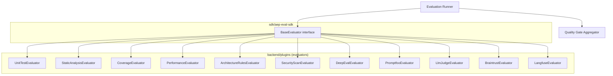

# AEP — Evaluation Framework Design

> Produced from `prompts/prompt7-Eval.md`. Implements the plugin system behind
> `POST /agent-runs/{runId}/evaluations` and `GET /tasks/{taskId}/quality-gate`
> ([04-api-design.md](04-api-design.md) §7), persisting into `evaluations` / `evaluation_results`
> ([03-db-design.md](03-db-design.md) §14–15 — note: that table's `evaluator_type` check
> constraint has been extended in this pass to include `braintrust` and `langfuse`, which the DB
> design doc's first draft omitted). Architecture and plugin interface only — no implementation.

## 1. Contract

**Input:** a completed `agent_run` plus a list of requested `evaluator_type`s.
**Output:** one `evaluations` row per requested evaluator, each producing one or more
`evaluation_results` rows (named metric, score, threshold, pass/fail), rolled up into a single
quality-gate verdict the Agent Orchestrator's approval gate reads.

## 2. The Base Evaluator Contract

```python
class BaseEvaluator(ABC):
    evaluator_type: EvaluatorType   # deepeval | promptfoo | llm_judge | braintrust | langfuse |
                                    # unit_test | integration_test | security_scan |
                                    # static_analysis | coverage | performance | architecture_rules

    @abstractmethod
    async def prepare(self, agent_run: AgentRunContext) -> EvaluatorInput: ...

    @abstractmethod
    async def execute(self, input: EvaluatorInput) -> EvaluatorOutput: ...

    @abstractmethod
    async def score(self, output: EvaluatorOutput) -> list[MetricScore]: ...

    @abstractmethod
    async def report(self, scores: list[MetricScore]) -> EvaluationReport: ...
```

**Why this exact four-phase shape (ADR-EV1):** it deliberately mirrors the Agent SDK's
`plan → execute → evaluate → report` (Agent SDK §2) — an engineer who understands one plugin
system already understands the other. The phases also do genuinely separable work:
`prepare()` gathers/builds whatever the evaluator needs (test fixtures, a diff, a dataset
reference, threshold config) and is the phase worth caching/reusing; `execute()` is the actual
run (a subprocess, an LLM call, a remote API call) and the phase worth retrying on transient
failure independent of re-preparing; `score()` normalizes raw output into comparable
`MetricScore`s; `report()` formats/persists the final record. Splitting them lets the framework
time, log, and retry each independently rather than treating an evaluator as one opaque call.

## 3. Two Categories of Evaluators

This distinction drives most of the framework's scheduling and infrastructure decisions, so it's
made explicit rather than left implicit in a flat list of twelve types:

| Category | Types | Characteristics |
|---|---|---|
| **Deterministic / tool-based** | `unit_test`, `integration_test`, `static_analysis`, `coverage`, `performance`, `architecture_rules`, (most of) `security_scan` | Run a subprocess/tool against the code diff; no LLM call; fast, cheap, fully synchronous, reproducible |
| **LLM-assisted / platform-based** | `deepeval`, `promptfoo`, `llm_judge`, `braintrust`, `langfuse` | Involve an LLM call (via the Model Provider SDK, ADR-002) and/or delegate to an external eval platform; slower, costlier, potentially non-deterministic, sometimes asynchronous |

### 3.1 Within "LLM-assisted": in-process libraries vs. external platforms

- **DeepEval, Promptfoo** — open-source, in-process evaluation libraries. The plugin invokes
  their SDK/CLI directly inside the sandbox (§6); no external network dependency beyond whatever
  LLM provider call the metric itself needs.
- **Braintrust, Langfuse** — hosted (or self-hosted) eval + observability platforms. The plugin
  pushes the `agent_run`'s trace/output to the platform's API and the platform performs the
  scoring (using its own dataset/scoring config, potentially its own judge model), returning a
  result asynchronously. This has a real architectural consequence — see §5.
- **LLM Judge** — a generic category, not tied to one vendor. It's most often implemented
  in-process via the Agent SDK's `EvaluationAgent` (Agent SDK §13) calling the Model Provider SDK
  directly with a judge prompt, but a project may instead route `llm_judge` through whichever of
  Braintrust/Langfuse/DeepEval/Promptfoo it already has configured. `llm_judge` is kept as its own
  `evaluator_type` specifically so a bespoke judge prompt isn't forced through a vendor tool it
  doesn't need.

## 4. Scheduling: Fail-Fast Ordering (ADR-EV2)

When a request names multiple evaluator types, the framework runs them in two waves:

1. **Deterministic evaluators run first, in parallel with each other.** They're cheap and fast;
   there's no reason to serialize them.
2. **LLM-assisted evaluators run second**, gated by a per-project `EvaluationPolicy`:
   - `run_all` (default) — run every requested evaluator regardless of wave-1 outcome, because
     `evaluation_results` also feeds the Metrics Service's quality-trend data (DB design §18) and
     losing that signal on a known-failing run makes trend analysis blind exactly when it matters.
   - `fail_fast` — skip wave 2 if any **required** wave-1 evaluator failed, to save LLM spend when
     the run is already going to be rejected regardless of what an LLM judge says.

The policy is project-level configuration, not a hardcoded framework behavior, because the
cost/completeness trade-off differs by team maturity and budget.

## 5. Asynchronous External Evaluators (ADR-EV4)

Braintrust and Langfuse don't return a score synchronously from `execute()` the way a unit-test
run does — the platform performs the eval on its own time. `EvaluatorOutput` therefore has an
explicit status:

```
EvaluatorOutput.status: "completed" | "pending_external"
EvaluatorOutput.external_ref_id: str | None   # set when pending_external
```

For `pending_external`, `score()` is **not called immediately** after `execute()`. Instead:

- A webhook endpoint (owned by the Evaluation Framework, not covered in the API design doc's
  public-facing list since it's a platform-to-platform callback, not a client-facing resource)
  receives the platform's completion event and invokes `score()`/`report()` at that point.
- A polling fallback (same pattern as the Agent SDK's heartbeat/timeout handling, Agent SDK §8)
  checks `external_ref_id` status on an interval if no webhook arrives within a configured window,
  so a dropped webhook delivery doesn't leave an evaluation stuck forever.

Until resolved, the `evaluations.status` (DB design §14) stays `running` — this is exactly the
existing enum, not a new value, because from the Orchestrator's point of view a pending external
evaluation and a still-running local one are the same thing: "not ready yet."

## 6. Tool Execution & Sandbox Reuse

Deterministic evaluators (`unit_test`, `static_analysis`, `coverage`, `performance`) execute
tools against the agent's code diff and must do so inside the same per-run sandbox/container
isolation the Agent SDK already requires for `CodingAgent`/`TestingAgent`/`SecurityAgent`
(Agent SDK §11) — this is deliberately the *same* sandbox infrastructure, not a second one built
for evaluators, since the trust boundary (agent-produced code, potentially adversarial or simply
buggy) is identical in both cases.

## 7. Quality Gate Aggregation (ADR-EV3)

Each evaluator's `score()` output is one or more `MetricScore { metric_name, score, threshold,
passed }`, persisted as `evaluation_results` rows (DB design §15). The gate itself is computed,
not stored, by `GET /tasks/{taskId}/quality-gate` (API design §7):

```
overall =
    "pending"  if any required evaluator has not yet reported
    "failed"   if any required evaluator's evaluations.status == 'failed'
               or any of its MetricScores has passed == false
    "passed"   otherwise
```

**Required vs. informational** is per-project `EvaluationPolicy` configuration (a list of
`evaluator_type`s marked required, with per-metric thresholds), not a hardcoded "every evaluator
that ran must pass." This is what lets, e.g., `performance` run and record trend data for every
task without blocking approval on it, while `unit_test` and `security_scan` are required and do
block. Without this distinction, adding a new informational evaluator to a project would silently
start blocking every future approval — an explicit required-list avoids that.

## 8. Plugin Architecture



Concrete plugins live under `backend/plugins`, register at boot against `sdk/aep-eval-sdk`'s
`BaseEvaluator` (same pattern as Agent SDK registration, Agent SDK §15, and Model Provider
registration, ADR-002) — adding a thirteenth evaluator type is additive, no Runner or Gate
Aggregator change required, satisfying the extensibility principle from the vision doc.

Each evaluator type declares its own config schema (validated by the plugin itself, not the
Runner — same delegation pattern as the Model Provider API, API design §8): e.g. `DeepEvalEvaluator`
config lists which DeepEval metrics to run and their thresholds; `BraintrustEvaluator` config holds
a project reference and dataset name; `StaticAnalysisEvaluator` config lists which linters/rulesets
to apply.

## 9. Key Decisions Summary

| ID | Decision | Why |
|---|---|---|
| ADR-EV1 | Same four-phase hook shape as the Agent SDK (`prepare/execute/score/report`) | Cross-platform consistency; each phase is independently cacheable/retryable |
| ADR-EV2 | Deterministic evaluators run first (parallel), LLM-assisted second, fail-fast configurable per project | Cost/latency control without losing trend data by default |
| ADR-EV3 | Required vs. informational evaluators, per-project policy, not hardcoded "all must pass" | Adding a new evaluator shouldn't silently start blocking approvals |
| ADR-EV4 | External platform evaluators (Braintrust/Langfuse) modeled with explicit `pending_external` + webhook/poll completion | Their scoring is genuinely asynchronous; forcing a synchronous `score()` would be a fiction |
| — | Evaluator sandboxing reuses the Agent SDK's tool-execution sandbox, not a second isolation mechanism | Same trust boundary (agent-produced code) as agent tool execution |

## 10. Out of Scope Here

This document defines the evaluator plugin contract, scheduling, and quality-gate aggregation
only. It does not define: the specific metrics/thresholds any one evaluator uses by default, the
webhook endpoint's request/response schema, or the sandbox provisioning mechanism itself (Agent
SDK's concern, referenced not redefined here).
