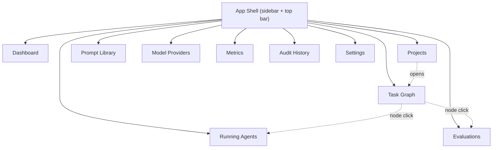

# AEP — Dashboard UX Specification

> Produced from `prompts/prompt8-Dashboard.md`. Specifies the ten screens served from
> `frontend/src/features/*` ([02-repo-design.md](02-repo-design.md) §4), backed by the Dashboard
> API and the resource APIs it composes ([04-api-design.md](04-api-design.md)). UX specification
> only — no React code, no component implementation.

## 1. Navigation Shell

Every screen shares one shell: a left sidebar (the ten screens below, in this order), a top bar
(project switcher, user menu, notification bell), and a content area. The sidebar order is
deliberately the rough order of "how often you'd check this": Dashboard and Projects first
(daily), Settings last (rarely).

**Project scoping:** most screens operate within the currently-selected project (top-bar
switcher); Running Agents, Metrics, and Audit History default to "all visible projects" with a
project filter, since their value is cross-project operational visibility.

## 2. Cross-Cutting Conventions

Stated once here, not repeated per screen:

- **Loading:** skeleton placeholders matching the eventual layout, never a bare spinner for
  content that has a known shape.
- **Empty state:** every list has a purpose-specific empty state with a call-to-action where one
  exists (e.g. Projects: "Create your first project"), never a generic "No data."
- **Error state:** an inline retry affordance at the component that failed, not a full-page error —
  one failed panel shouldn't blank the rest of a screen that loaded fine.
- **Permission-denied:** a screen/action a role cannot use is hidden, not shown-disabled, except
  where seeing that the control exists is itself useful context (e.g. a `viewer` sees an approve
  button as disabled with a tooltip explaining the required role, since knowing the action exists
  helps them know who to ask).
- **Status color coding** is uniform across every screen wherever a `tasks.status` or
  `agent_runs.status` value appears (DB design §6, §9): neutral gray (`pending`/`queued`), blue
  (`running`/`ready`), amber (`blocked`/`evaluating`/`awaiting_approval`/`retrying`), green
  (`approved`/`merged`/`succeeded`), red (`failed`/`rejected`), muted gray (`cancelled`).
- **Real-time updates:** the Agent Orchestrator's SSE endpoint (API design §5.6) is per-`agent_run`.
  Screens showing many runs at once (Task Graph, Running Agents) subscribe to one SSE stream per
  currently-visible in-flight run and merge events client-side; there is currently no
  single aggregate project-level event stream. This is noted as a scaling gap (§9) rather than
  silently designed around — at moderate concurrency (tens of visible runs) N SSE connections is
  fine; it stops being fine well before "hundreds," at which point an aggregate stream becomes a
  real API addition, not a frontend workaround.

## 3. Role-Visibility Matrix

| Screen | viewer | engineer | reviewer | admin |
|---|---|---|---|---|
| Dashboard | read | read | read + approval queue highlighted | read |
| Projects | read | read + create/edit | read | read + ownership transfer |
| Task Graph | read | read + assign/trigger run | read + approve/reject/merge | read |
| Running Agents | read | read + cancel | read + cancel | read + cancel |
| Evaluations | read | read + re-run | read | read |
| Prompt Library | read | read + create/edit/activate | read | read |
| Model Providers | read (list only) | read (list only) | read (list only) | full edit |
| Metrics | read | read | read | read |
| Audit History | hidden | hidden | hidden | read |
| Settings | profile tab only | profile tab only | profile tab only | all tabs |

This table is the UX-level restatement of the auth rules already fixed in the API design (§0.2)
and Evaluation Framework (§7) docs — no screen introduces a permission the API doesn't already
enforce; the UI's job is to reflect that, not decide it independently.

## 4. Screen: Dashboard (Home)

**Purpose:** answer "is anything on fire, and what needs my attention" in one glance.
**Data source:** `GET /dashboard/overview` (API design §11).

**Layout:**
- Top row of stat tiles: Active Projects, Running Agents, Pending Approvals, Evaluations (last
  24h) — each tile is a link into the corresponding screen, pre-filtered.
- Left column: **Recent Activity** feed, merging recent evaluations and audit events
  chronologically (from the overview payload).
- Right column: **Needs Attention** — for a `reviewer`, this is tasks in `awaiting_approval`
  assigned to their projects; for an `engineer`, it's failed runs/evaluations on tasks they own;
  content is role-dependent, not a fixed widget.

**Empty state:** a brand-new user with no projects sees an onboarding panel instead of empty
tiles: "Create your first project" (§5).

## 5. Screen: Projects

**Purpose:** the entry point to everything else — create/browse Projects and their Features.
**Data source:** `GET/POST /projects`, `GET/POST /projects/{id}/features`, `PUT
/projects/{id}/repository`.

**Layout:**
- **List view:** a table (name, owner, status, feature count, last activity) with filters
  (`status`, owner, text search) and a "New Project" button (`engineer`+).
- **Project detail** (drawer or dedicated route): repository link/health, a Features list (each
  row: title, status badge, task count), and a "New Feature" action opening a small form (title,
  description).
- **Feature detail:** description, status (with the transition control from API design §2's
  `POST /features/{id}/status`), and a prominent "View Task Graph" button — Feature detail is
  intentionally thin; the operational view of its work is the Task Graph screen, not duplicated
  here.

**Notable interaction:** archiving a project (`POST .../archive`) requires a confirmation dialog
naming the project, since archived projects disappear from default list filters and this is
change to shared state (per the "confirm before hard-to-reverse actions" principle carried from
the platform's own engineering norms).

## 6. Screen: Task Graph

**Purpose:** the operational center of the platform — visualize and act on a Feature's Task
Graph, i.e. drive the Create→Merge pipeline from the vision doc directly.
**Data source:** `GET /dashboard/projects/{projectId}/task-graph` (API design §11), plus
per-action calls (`assign`, `runs`, `approve`, `reject`, `merge` — API design §5).

**Layout:**
- A directed graph canvas: nodes are tasks (colored by status, per §2's convention), edges are
  dependencies (`blocks` edges solid, `informs` edges dashed). Pan/zoom; auto-layout topologically
  (dependency order flows left-to-right).
- Clicking a node opens a **Task Detail panel**: title/description, assigned agent, current/most
  recent `agent_run` (status, elapsed time, cost/tokens if completed), dependency list (with
  links), and the actions valid for its current status and the caller's role:
  - `ready`/`pending`, no agent assigned → **Assign Agent** (`engineer`)
  - assigned, not running → **Trigger Run** (`engineer`)
  - `awaiting_approval` → **Approve** / **Reject** (`reviewer`)
  - `approved` → **Merge** (`reviewer`/`admin`)
  - `running`/`retrying` → **Cancel**, and a live tail of SSE `log`/`heartbeat` events
- A **Regenerate Task Graph** button (`engineer`) calling `task-graph:generate`, disabled (not
  hidden) once any task has left `pending`, with a tooltip explaining why — regenerating over
  in-progress work is exactly the kind of destructive-looking action that should require an
  explicit, informed choice rather than a silent block.

**Empty state:** a Feature with no tasks yet shows a single centered "Generate Task Graph" call
to action instead of an empty canvas.

## 7. Screen: Running Agents

**Purpose:** the "what's happening right now" operational view across every project the caller
can see — the screen an engineer keeps open in a second monitor during a busy day.
**Data source:** `GET /dashboard/running-agents` (API design §11); per-row detail via SSE
(§5.6).

**Layout:**
- A live-updating table: Task, Project, Agent Type, Provider/Model, Status, Attempt #, Elapsed
  Time, Progress (from the most recent `heartbeat`'s `progress_percent`, when the agent reports
  one). Auto-refreshes via SSE, not polling, for rows currently in view.
- Row click opens a detail drawer: the same log/heartbeat tail as the Task Graph screen's panel
  (shared component — this is the one place the same live-run view appears in two screens, so it
  is built once and used twice, not redesigned per screen).
- **Cancel** action per row (`engineer`/`reviewer`), with a confirmation step naming the task
  (cancellation of a mid-flight agent is cooperative per the Agent SDK, but from the UI's
  perspective it should still read as a deliberate, confirmed action).

**Empty state:** "No agents currently running" — a calm, positive-framed empty state, since an
empty list here is a good outcome, not a problem to fix.

## 8. Screen: Evaluations

**Purpose:** inspect quality-gate results — the primary place to answer "why isn't this
approved yet" or "why did this fail."
**Data source:** `GET /agent-runs/{runId}/evaluations`, `/evaluations/{id}/results`,
`/tasks/{taskId}/quality-gate` (API design §7).

**Layout:**
- Filterable list (project, evaluator type, status, date range) of evaluations, each row showing
  evaluator type, status, and an overall pass/fail chip.
- Row detail: every `MetricScore` (metric name, score, threshold, pass/fail) as a small table,
  plus — for `braintrust`/`langfuse` evaluations still in `pending_external` (Evaluation Framework
  §5) — a distinct "Awaiting external result" state with a spinner, not conflated with `running`
  for a local evaluator, since the caller can't do anything to speed either one up but should
  understand *why* it's slow differently.
- A **Quality Gate** summary card per task: overall `passed`/`failed`/`pending`, with required
  evaluators visually distinguished from informational ones (Evaluation Framework §7) — this is
  the one place the required/informational distinction must be visible in the UI, since otherwise
  a user sees an "informational" evaluator's failure and wrongly assumes it's blocking approval.
- A trend panel: pass-rate over time per evaluator type, sourced from the Metrics API
  (`GET /metrics/summary?metric_name=evaluation.pass_rate&group_by=day`).
- **Re-run** action (`engineer`) calling `POST /agent-runs/{runId}/evaluations` again for a
  selected evaluator type.

## 9. Screen: Prompt Library

**Purpose:** manage prompt templates and their version history.
**Data source:** `GET/POST /prompt-templates`, `/versions`, `/versions/{n}/activate` (API
design §6).

**Layout:**
- List: template name, owner, active version number, last updated.
- Detail: a version history timeline (newest first), each entry showing its `variables` list and
  an **Activate** button (only enabled on a non-active version); selecting two versions shows a
  text diff between them.
- **New Version** editor: a plain textarea for `content` plus a structured `variables` list
  builder (name + required flag per row) — not a rich prompt-authoring IDE at v1; that's a
  plausible future enhancement, not a v1 requirement.

**Notable state:** a freshly created version that hasn't been activated is visually marked "Draft"
so it's clear it isn't yet what agents are actually using.

## 10. Screen: Model Providers

**Purpose:** admin configuration of the Model Provider SDK's registered plugins.
**Data source:** `GET /providers`, `PATCH /providers/{id}`, `GET /providers/{id}/models`
(API design §8).

**Layout:**
- One card per provider (Claude, OpenAI, Gemini, Vertex AI, and any future registration): enabled
  toggle, default model selector (from `/models`), and a health indicator (last successful call
  timestamp / last error).
- Each card's config panel is **rendered dynamically from the plugin's own config schema**
  (Evaluation Framework §8 and the API design's provider-config validation both use this same
  delegated-schema pattern) — the Dashboard does not hardcode a form per provider; a new provider
  plugin's config UI appears automatically from its schema.
- `viewer`/`engineer` see this screen read-only (cards, no toggles/edit controls) — visible so
  everyone can see what's available, editable only by `admin`, matching §3's matrix.

## 11. Screen: Metrics

**Purpose:** cost, latency, and quality analytics — the screen for "how much is this costing us"
and "are agents getting better or worse over time."
**Data source:** `GET /metrics/summary`, `/projects/{id}/metrics/summary` (API design §9).

**Layout:**
- Filter bar: project, agent, provider, metric, date range.
- Chart panels: cost over time (stacked by provider), token usage by agent type, run latency
  distribution, evaluation pass-rate trend. Each panel is independently loading/error-stated (§2)
  so one slow query doesn't block the rest of the screen.
- **Export CSV** action on any panel's underlying data.

## 12. Screen: Audit History

**Purpose:** the compliance-facing, immutable event browser.
**Data source:** `GET /audit-events` (API design §10) — `admin` only; the screen itself is not
present in the sidebar for other roles (per §3).

**Layout:**
- Filterable table: entity type, entity id, event type, actor (user or agent), date range.
  Expanding a row shows the full `payload` JSON.
- The date range filter **defaults to the last 7 days** rather than being optional-and-empty —
  this exists specifically to avoid tripping the API's `X-Unbounded-Query` warning (API design
  §10) on first load; a user can explicitly widen or clear it, but the default is bounded.

## 13. Screen: Settings

**Purpose:** everything account- and workspace-level that doesn't belong on an operational screen.
**Layout:** tabbed.

| Tab | Visible to | Content |
|---|---|---|
| Profile | everyone | Display name, email (read-only, sourced from the IdP), assigned roles (read-only) |
| Users & Roles | admin | User list, grant/revoke role (`POST`/`DELETE /users/{id}/roles`) |
| Evaluation Policy | admin (edit), engineer (read) | Per-project required-evaluator list and thresholds (Evaluation Framework §7) — this is where the required-vs-informational distinction shown read-only on the Evaluations screen is actually configured |
| Notifications | everyone | Placeholder at v1 — no notification-delivery API exists yet in this design series; the tab exists as a known future need, not a working feature |

An "API Access" tab (personal access tokens for CI/CLI use) is deliberately **not included** — no
endpoint for token issuance exists anywhere in the API design doc, and adding the UI ahead of the
API would just be a dead end.

## 14. Out of Scope Here

This document specifies screen layout, data sources, states, and role visibility only. It does
not define: visual design tokens/theming (MUI theme, per the repo design's `frontend/src/theme`),
component implementation, or the aggregate multi-run event stream flagged as a gap in §2 — that
would be a future addition to the API design doc, not something this UX spec can resolve on its
own.
